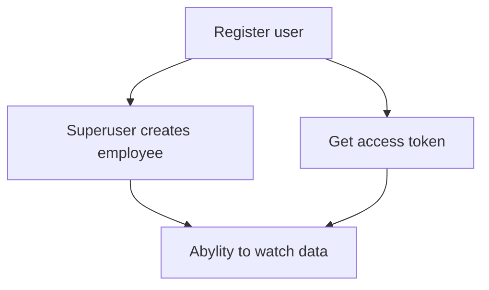
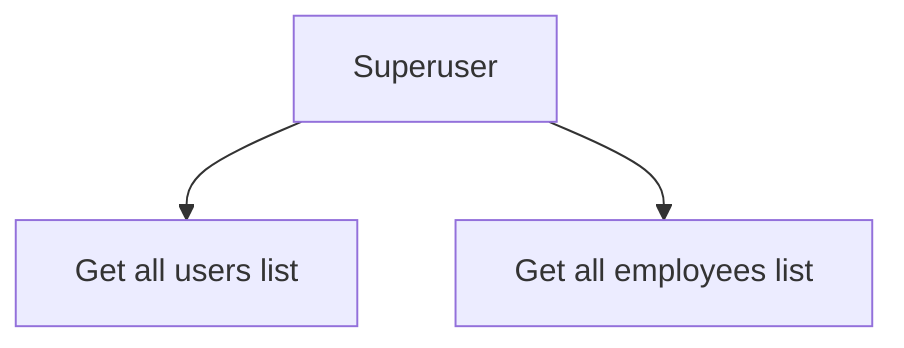

# Web-application for employees.

Application is written using FastAPI framework (really it is a test task). I tried many different versions of architecture,
but this one seems to be the best. I really hope you like it, I just tried to user everything I know on 
this kind of project and user some new tools (poetry, pytest, docker). It is not over-engineering for this task, it's
comfort app to change and add, to broad it. Waiting for your issues and PR's.

## Task (literally)
Build REST-service for watching current salary and date of the next promotion.
Every employee is able to watch its own data because data is very important and critical.
For the security providing, you should realize method for getting time-expiring token
by employee's login and password. Data on employee's request is to be shown only if token validation is 
successful.

### Requirements for solution:
 Must-have:
- code is published on the public `GitLab` repository;
- the project-constructing instruction is provided;
- `FastAPI` realization.

Non must-have:
- `poetry` pacakge manager;
- `pytest` tests;
- `Docker` containers.


## Description (thoughts)
Well, the idea is simple. I just have to realize token authorization. The best way
is JWT Bearer token in request headers. But we also must have users interface. So registering is here.
But user itself cannot be registered as employee. Employee is taken by the superuser (kinda BOSS).

So after all I also have to realize registering, superuser and creating employee on user logic (it's quite logical, I think).




Also superuser can:



## Running
## Python

Personally I used Python 3.11.

Clone the repository:
```commandline
git clone "https://github.com/michael7nightingale/Test-task-FastAPI.git"
```

Install requirements:
```commandline
pip install -r requirement.txt
```

For testing and development:
```commandline
pip install -r dev-requirements.txt
```

## Environment

For development create .dev.env file in the root directory (it is also a working dir.)
Fill it with your data. Of course, database should be started on your device.
```.dotenv
#.dev.env file

DB_NAME=employees
DB_HOST=localhost
DB_PORT=5432
DB_USER=postgres
DB_PASSWORD=password

SECRET_KEY=1239ajncoikjaj123as0dnc

POSTGRES_DB=employees
POSTGRES_USER=postgres
POSTGRES_PASSWORD=password

SUPERUSER_NAME=admin
SUPERUSER_PASSWORD=password
SUPERUSER_EMAIL=suslanchikmopl@gmail.com
```

## Running server

Run it with the python file by:
```commandline
cd src
python main.py
```

...or by uvicorn 
```commandline
cd src
uvicorn main:app --reload
```

## Tests
 Tests are provided to test all application work. Pytest is used.

```commandline
cd src
pytest tests
```

## Pycharm using

If you use Pycharm, please make sure that your working directory
is correct. It should be the `src`. The same in terminal.


